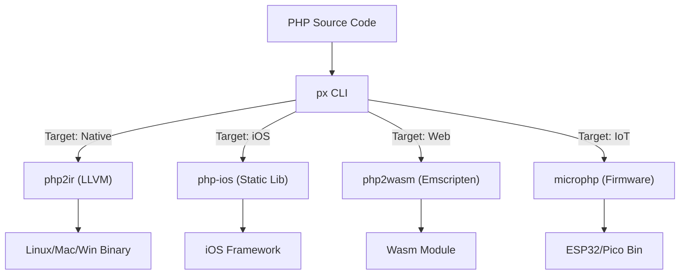

# php-universe / px

[](LICENSE)
[](https://php.net)

**The Universal PHP Toolchain.**  
*Write Once. Compile Everywhere. No, really.*

**`px`** is a CLI build system that unifies the PHP systems ecosystem. It orchestrates [php2ir](https://github.com/makalin/php2ir), [php-ios](https://github.com/makalin/php-ios), [php2wasm](https://github.com/makalin/php2wasm), and [microphp](https://github.com/makalin/microphp) to compile a single PHP codebase into native binaries, mobile apps, web assembly modules, or embedded firmware.

> 📚 **New to the ecosystem?** Check out [TOOLS.md](TOOLS.md) for comprehensive documentation of all PHP tools, including versions, release dates, and detailed explanations.

-----

## 🚀 Why?

PHP is the world's most popular web language, but it has been trapped in the server-side request/response cycle. The tools to break it out exist, but they are fragmented.

**`px`** changes the paradigm. It allows you to build:

  * **Systems Tools** (CLI apps, Daemons) → via **LLVM/Native**
  * **Mobile Logic** (Offline, On-device) → via **iOS Static Libs**
  * **Edge/Browser** (Sandboxed Agents) → via **WASM**
  * **IoT/Hardware** (Microcontrollers) → via **Embedded Runtime**

...all using the same `src/` directory and familiar PHP syntax.

-----

## 📦 Architecture

`px` acts as a meta-compiler and dependency manager. It reads a `universe.toml` configuration and delegates compilation to the specialized engines developed by [@makalin](https://github.com/makalin).



-----

## 🛠 Installation

### Prerequisites

- **PHP 8.2+** (with Composer)
- **Clang/LLVM** (for native compilation)
- **Target-specific SDKs:**
  - **iOS:** Xcode with iOS SDK
  - **WASM:** Emscripten SDK
  - **Embedded:** ESP-IDF or Pico SDK

### Install px CLI

```bash
composer global require makalin/php-universe
```

Verify installation:

```bash
px --version
px --help
```

### Install Individual Tools

If you only need specific tools, you can install them individually:

```bash
# Core compilation engines
composer require makalin/php2ir        # Native binaries
composer require makalin/php-ios       # iOS apps
composer require makalin/php2wasm      # WebAssembly
composer require makalin/microphp      # Embedded/IoT

# Supporting libraries
composer require makalin/phastron           # AST & data structures
composer require makalin/php-embeddings     # Vector embeddings
composer require makalin/php-querylang      # Query builder
composer require makalin/php-cron-dsl       # Cron scheduling
composer require makalin/htmxphp            # HTMX integration
```

See [TOOLS.md](TOOLS.md) for complete documentation of all available tools.

-----

## ⚡ Quick Start

### 1. Initialize a Universal Project

```bash
px new my-super-app
cd my-super-app
```

This creates a standard project structure:

```text
my-super-app/
├── src/
│   └── main.php          # Your entry point
├── universe.toml         # Build configuration
├── composer.json         # PHP dependencies
└── vendor/               # Composer packages
```

### 2. Write Your PHP Code

Create your application logic in `src/main.php`:

```php
<?php
// src/main.php

function greet(string $name): string {
    return "Hello, {$name}! Welcome to php-universe.";
}

function calculate(int $a, int $b): int {
    return $a + $b;
}

// Entry point
if (php_sapi_name() === 'cli') {
    echo greet("World") . PHP_EOL;
    echo "2 + 3 = " . calculate(2, 3) . PHP_EOL;
}
```

### 3. Configure Targets (`universe.toml`)

Tell `px` where you want your code to run by editing `universe.toml`:

```toml
[project]
name = "SuperApp"
version = "1.0.0"
entry = "src/main.php"
description = "A universal PHP application"

[targets.native]
enabled = true
optimization = "O3"          # O0, O1, O2, O3
output = "dist/superapp"
strip = true                 # Remove debug symbols

[targets.ios]
enabled = true
bundle_id = "com.dv.superapp"
minimum_ios_version = "13.0"
frameworks = ["Foundation"]

[targets.wasm]
enabled = true
expose_functions = ["greet", "calculate"]
memory_size = "16MB"
optimization = "O3"

[targets.embedded]
enabled = false
platform = "esp32"          # esp32 or rp2040
flash_size = "4MB"
```

### 4. Build Your Application

```bash
# Build for your current platform (Native)
px build --target=native

# Build for iOS
px build --target=ios

# Build for WebAssembly
px build --target=wasm

# Build for embedded device
px build --target=embedded

# Build all enabled targets
px build --all

# Clean build artifacts
px clean
```

### 5. Run Your Application

```bash
# Native binary
./dist/superapp

# Or test in different environments
px run --target=native
px run --target=wasm  # Starts local WASM server
```

## 📖 More Examples

### Example 1: CLI Tool

Create a command-line utility that works across platforms:

```php
<?php
// src/cli_tool.php

function processFile(string $filename): array {
    if (!file_exists($filename)) {
        throw new RuntimeException("File not found: {$filename}");
    }
    
    $content = file_get_contents($filename);
    $lines = explode("\n", $content);
    
    return [
        'lines' => count($lines),
        'chars' => strlen($content),
        'words' => str_word_count($content),
    ];
}

if (php_sapi_name() === 'cli') {
    $file = $argv[1] ?? 'php://stdin';
    $stats = processFile($file);
    echo json_encode($stats, JSON_PRETTY_PRINT) . PHP_EOL;
}
```

**Build and run:**
```bash
px build --target=native
./dist/cli_tool README.md
```

### Example 2: Data Processing Library

Create a library that can run in browser, mobile, or server:

```php
<?php
// src/DataProcessor.php

class DataProcessor {
    public static function filter(array $data, callable $predicate): array {
        return array_filter($data, $predicate);
    }
    
    public static function map(array $data, callable $transform): array {
        return array_map($transform, $data);
    }
    
    public static function reduce(array $data, callable $reducer, $initial = null) {
        return array_reduce($data, $reducer, $initial);
    }
}

// Example usage
$numbers = [1, 2, 3, 4, 5, 6, 7, 8, 9, 10];
$evens = DataProcessor::filter($numbers, fn($n) => $n % 2 === 0);
$sum = DataProcessor::reduce($evens, fn($a, $b) => $a + $b, 0);
```

This same code compiles to:
- **Native:** Fast binary for server processing
- **WASM:** Client-side processing in browser
- **iOS:** On-device processing in mobile app

### Example 3: Using Ecosystem Libraries

Leverage the php-universe ecosystem:

```php
<?php
// src/ai_agent.php

use PhpEmbeddings\VectorDB;
use QueryLang\Query;

class AIAgent {
    private array $memory = [];
    
    public function process(string $input): string {
        // Convert input to vector embedding
        $vector = VectorDB::embed($input);
        
        // Search memory using query language
        $results = Query::select('*')
            ->from($this->memory)
            ->where('similarity', '>', 0.85)
            ->orderBy('score', 'DESC')
            ->limit(5)
            ->run();
        
        return json_encode($results);
    }
}
```

See [TOOLS.md](TOOLS.md) for all available libraries and their capabilities.

-----

## 🧠 The Engines

`px` relies on a suite of high-performance PHP innovations. Each engine specializes in a specific target platform:

| Engine | Purpose | Target Platform | Usage |
| :--- | :--- | :--- | :--- |
| **[php2ir](https://github.com/makalin/php2ir)** | **Native Compilation** | Linux, macOS, Windows | Compiles PHP 8.x directly to LLVM IR, producing standalone binaries with no VM overhead | `px build -t native` |
| **[php-ios](https://github.com/makalin/php-ios)** | **Mobile Development** | iOS (iPhone, iPad) | Embeds a static PHP runtime into iOS apps. Fully App Store compliant | `px build -t ios` |
| **[php2wasm](https://github.com/makalin/php2wasm)** | **WebAssembly** | Browser, Cloudflare Workers | Compiles PHP to WASM for client-side execution | `px build -t wasm` |
| **[microphp](https://github.com/makalin/microphp)** | **Embedded/IoT** | ESP32, RP2040 | Ultra-lightweight (~2MB) runtime for microcontrollers | `px build -t embedded` |
| **[phastron](https://github.com/makalin/phastron)** | **Standard Library** | All platforms | High-performance AST and data structures optimized for compiled PHP | *Auto-included* |

### Supporting Tools & Libraries

The ecosystem includes additional tools for enhanced functionality:

- **[php-embeddings](https://github.com/makalin/php-embeddings)** - Vector embeddings and semantic search
- **[php-querylang](https://github.com/makalin/php-querylang)** - Fluent query builder for data sources
- **[php-cron-dsl](https://github.com/makalin/php-cron-dsl)** - Human-readable cron scheduling
- **[php-tauri](https://github.com/makalin/php-tauri)** - Desktop app development with Tauri
- **[php-supply-chain-guard](https://github.com/makalin/php-supply-chain-guard)** - Security auditing for PHP extensions
- **[php-monorepo-splitter](https://github.com/makalin/php-monorepo-splitter)** - Monorepo management tool
- **[htmxphp](https://github.com/makalin/htmxphp)** - HTMX integration helpers

📚 **For detailed documentation, versions, and release dates, see [TOOLS.md](TOOLS.md)**

-----

## 💡 Real-World Use Cases

### Use Case 1: Edge AI Agent

An AI agent that processes data locally without server round-trips:

**`src/Agent.php`**

```php
<?php
use PhpEmbeddings\VectorDB;
use QueryLang\Query;

class EdgeAgent {
    private array $memory = [];
    
    public function process(string $input): array {
        // 1. Convert input to vector embedding
        $vector = VectorDB::embed($input);
        
        // 2. Query local memory (no API calls!)
        $results = Query::select('*')
            ->from($this->memory)
            ->where('similarity', '>', 0.85)
            ->orderBy('score', 'DESC')
            ->limit(10)
            ->run();
        
        return $results;
    }
    
    public function remember(string $key, array $data): void {
        $this->memory[$key] = $data;
    }
}
```

**Deploy everywhere:**
- **Server:** Compiles to a fast binary microservice (`px build -t native`)
- **Browser:** Runs client-side to save bandwidth (`px build -t wasm`)
- **Mobile:** Runs inside the user's secure enclave (`px build -t ios`)

### Use Case 2: IoT Sensor Processor

Process sensor data directly on the device:

**`src/sensor.php`**

```php
<?php
class SensorProcessor {
    public function process(array $readings): array {
        $avg = array_sum($readings) / count($readings);
        $max = max($readings);
        $min = min($readings);
        
        return [
            'average' => round($avg, 2),
            'max' => $max,
            'min' => $min,
            'timestamp' => time(),
        ];
    }
}
```

Compile for ESP32: `px build -t embedded --platform=esp32`

### Use Case 3: Cross-Platform Data Validator

Validate data structures that work everywhere:

**`src/validator.php`**

```php
<?php
class DataValidator {
    public static function validateEmail(string $email): bool {
        return filter_var($email, FILTER_VALIDATE_EMAIL) !== false;
    }
    
    public static function validateJSON(string $json): ?array {
        $decoded = json_decode($json, true);
        return json_last_error() === JSON_ERROR_NONE ? $decoded : null;
    }
}
```

Use the same validation logic in:
- Native CLI tools
- Web applications (WASM)
- Mobile apps (iOS)
- Embedded devices

-----

## 🛠 CLI Commands

The `px` command-line interface provides various operations:

```bash
# Project management
px new <project-name>              # Create a new project
px init                            # Initialize in current directory

# Building
px build [--target=<target>]       # Build for specific target
px build --all                     # Build all enabled targets
px build --target=native           # Build native binary
px build --target=ios              # Build iOS framework
px build --target=wasm             # Build WebAssembly module
px build --target=embedded         # Build embedded firmware

# Development
px run [--target=<target>]         # Run built application
px watch                           # Watch mode with hot reload
px clean                           # Clean build artifacts
px test                            # Run tests

# Information
px --version                       # Show version
px --help                          # Show help
px list-targets                   # List available targets
px list-tools                      # List available tools
```

## 🗺 Roadmap

### Planned Features

- [ ] **Package Manager**: A `cargo`-like dependency resolver that ensures packages are compatible with specific targets (e.g., flagging dependencies that use `curl` when compiling for `microphp`)
- [ ] **Hot Reload**: `px watch` for instant feedback during native development (powered by [php-tauri](https://github.com/makalin/php-tauri))
- [ ] **FFI Scaffolding**: Auto-generate PHP bindings for C libraries during the native build process
- [ ] **Cross-compilation**: Build for different platforms from a single machine
- [ ] **Debugging Support**: Integrated debugging tools for compiled targets
- [ ] **Performance Profiling**: Built-in profiling and optimization suggestions

### Contributing Features

Have an idea? Check out our [Contributing Guidelines](CONTRIBUTING.md) or open an issue on GitHub.

-----

## 📚 Documentation

- **[TOOLS.md](TOOLS.md)** - Comprehensive documentation of all PHP tools in the ecosystem, including versions, release dates, and detailed explanations
- **[EXAMPLES.md](EXAMPLES.md)** - Practical code examples and tutorials for all platforms
- **[examples/](examples/)** - Working sample projects you can run and learn from
- **[utils/](utils/)** - Reusable utility functions and classes
- **[tools/](tools/)** - Development tools and helpers
- **[scripts/](scripts/)** - Helper shell scripts for common tasks
- **[CONTRIBUTING.md](CONTRIBUTING.md)** - Guidelines for contributing to the project
- **[API Reference](docs/api.md)** - Complete API documentation (coming soon)

### Quick Links to Examples

- **[Hello World](examples/hello-world/)** - Simplest example to get started
- **[CLI Tool](examples/cli-tool/)** - File processor command-line tool
- **[WASM Calculator](examples/wasm-calculator/)** - Browser-based calculator
- **[Cross-Platform Library](examples/cross-platform-lib/)** - Math library for all targets
- **[Data Processor](examples/data-processor/)** - Data processing with utilities

### Development Tools

- **[Project Scaffolder](tools/project-scaffold.php)** - Generate new project structure
- **[Config Validator](tools/config-validator.php)** - Validate universe.toml files
- **[Build Script](scripts/build-all.sh)** - Build for all enabled targets
- **[Test Script](scripts/test.sh)** - Run project tests
- **[Clean Script](scripts/clean.sh)** - Remove build artifacts

## 🤝 Contributing

This is a meta-project that orchestrates multiple specialized tools. Contributions are welcome!

**How to contribute:**
1. **Report Issues**: Found a bug? Open an issue on the relevant repository
2. **Suggest Features**: Have an idea? Open a discussion or issue
3. **Submit PRs**: Fix bugs or add features to any tool in the ecosystem
4. **Improve Docs**: Help make the documentation better

**Where to contribute:**
- **Core tools**: Contribute to [php2ir](https://github.com/makalin/php2ir), [php-ios](https://github.com/makalin/php-ios), [php2wasm](https://github.com/makalin/php2wasm), or [microphp](https://github.com/makalin/microphp)
- **Libraries**: Contribute to [phastron](https://github.com/makalin/phastron), [php-embeddings](https://github.com/makalin/php-embeddings), or other supporting libraries
- **Meta-project**: Contribute to this repository for `px` CLI improvements

## ❓ FAQ

**Q: Can I use existing PHP libraries?**  
A: Yes! Most PHP libraries work, but some features (like `eval()`, `curl`, or file system operations) may be limited depending on the target platform. Check [TOOLS.md](TOOLS.md) for compatibility information.

**Q: What's the performance like?**  
A: Native binaries compiled with `php2ir` can be 10-100x faster than traditional PHP, depending on the workload. WASM and iOS targets have minimal overhead compared to interpreted PHP.

**Q: Can I debug compiled code?**  
A: Yes, debugging support is available for native targets. WASM debugging works with browser DevTools. iOS debugging integrates with Xcode.

**Q: Is this production-ready?**  
A: The tools are actively developed and used in production. Check each tool's repository for stability status and version information.

**Q: How do I get help?**  
A: Open an issue on the relevant repository, check [TOOLS.md](TOOLS.md) for documentation, or join discussions on GitHub.

## 📜 License

MIT © 2025 [Mehmet T. AKALIN](https://github.com/makalin)

Supported by [Digital Vision](https://dv.com.tr)

---

**Made with ❤️ for the PHP community**
